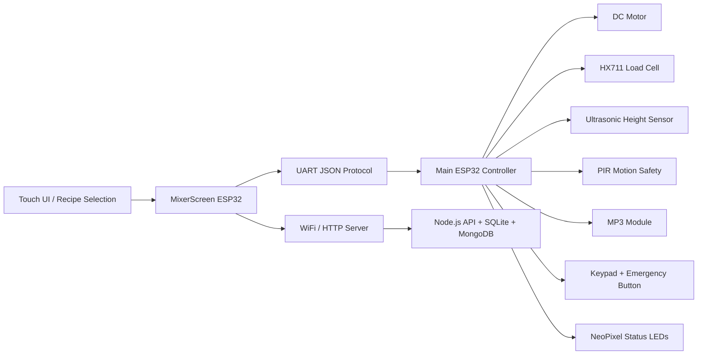

# Smart Mixer – Embedded Control System for Automated Kitchen Mixing

## Overview

Smart Mixer is an embedded systems project focused on automating ingredient handling, mixing, and foam generation in a kitchen appliance. The system is implemented around ESP32 microcontrollers and a C++ firmware architecture that performs real-time motor control, sensor-driven decision making, and state-based orchestration for safe operation.

The project combines hardware integration, embedded software, and software coordination into a single control platform. The Main controller executes the physical mixing workflow and enforces safety and timing constraints, while the MixerScreen controller manages the interface and recipe execution flow. A backend layer provides recipe metadata, authentication, and reference data for the broader system.

This repository demonstrates a multi-layer embedded design: firmware for hardware control, a display/controller board for user interaction, and a server for data management and administration.

## Technology Stack

- Embedded controllers: ESP32
- Firmware language: C++
- Communication: UART / JSON protocol
- Sensors: HX711 load cell, ultrasonic distance sensor, PIR motion sensor
- Actuation: DC motor with PWM control
- User interface: TFT display with touch input
- Backend: Node.js, Express, SQLite, MongoDB
- Client: React application for administration and recipe management

---
---

## 1. System Overview

The Smart Mixer system is built around two ESP32-based hardware controllers:

1. Main board (folder: Main)
   - Executes the physical mixer logic
   - Monitors load cell, ultrasonic sensor, PIR safety input, keypad, emergency stop, and MP3 playback
   - Controls motor speed and sequencing
   - Communicates with the display board over UART

2. Screen board (folder: MixerScreen/MixerScreen)
   - Runs the user interface on a TFT display
   - Handles WiFi and HTTP access to the server
   - Resolves recipes into executable steps
   - Sends commands to the Main board over UART

The board-to-board communication is JSON-based over Serial1/Serial2 and follows a strict command/status protocol defined in the Protocol.h files.



---

## 2. Hardware Architecture

### 2.1 Main Controller

The Main firmware is the real machine controller. It owns the hardware safety and motion logic.

Core responsibilities:

- Motor control and speed regulation
- Weight measurement and conversion
- Foam height estimation using ultrasonic sensing
- Motion detection for safety responses
- Recipe step execution sequencing
- Stop/resume logic for operator intervention
- Audio feedback and LED signaling

Key files:

- Main/Main.ino
- Main/Config.h
- Main/Protocol.h
- Main/States.h
- Main/statesMechine.ino
- Main/Communication.cpp
- Main/DC.ino
- Main/loadCell.ino
- Main/ultra-sonic.ino
- Main/PIR.ino
- Main/LED.ino
- Main/MP3.ino
- Main/keypad.ino
- Main/button.ino

### 2.2 Screen Controller

The screen board is an interaction and orchestration layer. It does not directly drive the mixer mechanics; it converts recipe and UI events into commands for the Main controller.

Core responsibilities:

- WiFi initialization and connection management
- Recipe fetch from backend API
- Built-in recipe resolution and scaling
- TFT touch UI and input collection
- UART translation of commands and status updates
- Safety stop display and resume workflows

Key files:

- MixerScreen/MixerScreen/MixerScreen.ino
- MixerScreen/MixerScreen/Config.h
- MixerScreen/MixerScreen/Protocol.h
- MixerScreen/MixerScreen/Communication.cpp
- MixerScreen/MixerScreen/UI.cpp
- MixerScreen/MixerScreen/RecipeExecutor.cpp
- MixerScreen/MixerScreen/WiFiManager.cpp
- MixerScreen/MixerScreen/HttpClient.cpp
- MixerScreen/MixerScreen/builtin_recipes.h
- MixerScreen/MixerScreen/builtin_conversions.h

### 2.3 Backend and Data Layer

The server is not part of the real-time motion controller, but it supplies recipe data, lookup tables, and admin credentials. It is built for configuration, persistence, and maintenance rather than machine control timing.

Main backend components:

- Node.js + Express API server
- SQLite for ingredient, unit, conversion, and foam-type reference tables
- MongoDB for recipe storage and recipe management
- Session-based authentication for editing actions

Key files:

- server/server.js
- server/app.js
- server/db/sqlite.js
- server/db/mongo.js
- server/routes/*.js
- server/models/*.js
- server/seed/*.js

---

## 3. Electrical and Sensor Hardware

### 3.1 Pin Map and Device Roles

The pin assignments are defined in Main/Config.h and the display board configuration in MixerScreen/MixerScreen/Config.h.

| Device | Pin(s) | Purpose |
|---|---|---|
| DC motor driver | 26, 27 | PWM-controlled motor direction and power |
| HX711 load cell | 4, 5 | weight measurement |
| Ultrasonic sensor | 32, 35 | foam height / distance measurement |
| PIR sensor | 34 | safety motion detection |
| DFPlayer MP3 | 16, 17 | audio prompts and warnings |
| NeoPixel strip | 22 | status and warning indicators |
| Emergency stop button | 14 | physical stop trigger |
| Keypad matrix | 4x4 | recipe code / input selection |
| UART to display board | 25, 21 | sensor controller ⇄ screen controller |

Notes:

- The motor uses LEDC PWM channels with 8-bit resolution and 5 kHz frequency.
- The sensor controller uses Serial1 for the UART link to the screen board.
- The display board uses Serial2 for its UART communication to the main controller.
- The gear and motor logic should be treated as a safety-critical actuator, with mechanical protection and braking logic considered in a production build.

### 3.2 Main Actuation Path

The motor is controlled from Main/DC.ino via:

- initDC()
- runMotor(int speed)
- stopMotor()
- runMotorForTime(int speed, int durationMs)
- runMotorToDistance(int speed, int distance)

The controller is intentionally simple: it sends PWM to a single DC motor channel and uses the actual sensor feedback to determine whether a mixing or whipping step is complete.

### 3.3 Sensors and Feedback Loops

#### Load Cell

The load cell is connected through HX711 and calibrated using CALIBRATION_FACTOR in Main/Config.h.

Important logic:

- initLoadCell() begins the sensor and performs tare
- updateWeight() refreshes the global currentWeight
- checkWeightChange(float newWeight) validates whether a target weight has been reached
- isWeightUp(float requiredAmount) detects when the load cell crosses a threshold

This is central to additive steps such as ADD, MIX_ADD, and WHIP_ADD.

#### Ultrasonic Distance Sensor

The ultrasonic module measures foam height or object presence. The firmware:

- updates the distance baseline before whip or foam operations
- checks whether target height is reached
- uses the delta between measured distance and baseline to determine completion

This allows the machine to stop the motor when foam reaches the desired height rather than relying solely on time.

#### PIR Motion Safety

The PIR input is used to detect human presence around the mixing area and generate a motion alert. The code uses motion detection to trigger LED warnings and temporarily suppress normal rainbow animations. This is a safety feature, not just a cosmetic effect.

### 3.4 Audio and Visual Signaling

The system uses:

- DFPlayer mini module for spoken prompts, instructions, and warnings
- NeoPixel LED strip for runtime status and success/failure signaling

LED states:

- green = successful completion
- red = motion/stop alert
- rainbow = normal operating background animation
- clear = idle/off

---

## 4. Protocols and Communication

### 4.1 UART Protocol

The communication contract between the Main board and the MixerScreen board is defined in both Protocol.h files. The protocol is JSON-over-serial with newline delimiters.

Commands from the screen to the main controller include:

- ADD
- MIX
- WHIP
- MIX_ADD
- WHIP_ADD
- SELECT_CODE
- STOP
- RESUME

Statuses from the main controller to the screen include:

- WEIGHT_UPDATE
- DONE
- KEYPAD_STROKE
- STOP event with current state information

The main controller parses incoming JSON in Communication.cpp and updates currentState based on the commandType value.

### 4.2 Execution Example

A typical sequence is:

1. User selects recipe or enters code on the TFT board.
2. Screen resolves recipe into steps and calculates scaled amounts.
3. Screen sends a command such as MIX or WHIP to the Main board.
4. Main board enters a state, starts the motor, and monitors sensors.
5. Main board sends live weight or status updates back to the screen.
6. When the target weight/distance/time is reached, Main sends DONE.
7. The screen advances to the next step or returns home.

---

## 5. State Machine and Safety Behavior

The embedded controller uses a state machine that centers on the enum defined in States.h.

Main states:

- STATE_IDLE
- STATE_CODE_SELECTION
- STATE_MIXING
- STATE_WHIPPING
- STATE_ADD_INGREDIENT
- STATE_MIX_AND_ADD
- STATE_WHIP_AND_ADD
- STATE_EMERGENCY_STOP
- STATE_SUCCESS_DONE

The file statesMechine.ino contains the complete operational logic, including nested sub-states for additive and sequential operations.

### 5.1 Safety Behavior

Critical safety behavior is implemented in:

- button.ino
- PIR.ino
- statesMechine.ino
- Communication.cpp

The emergency-stop path is explicit:

- if the physical button becomes active while the motor is running, the motor is stopped immediately
- the current running state is stored in previousState
- a STOP message is sent to the screen
- the system enters STATE_EMERGENCY_STOP
- the screen can then support resume, skip, or cancel decisions

This is a meaningful protected-state flow for operator safety.

### 5.2 Motor Safety Considerations

Although the current firmware is functional, it is important to call out that the motor drive path should be hardened for production use:

- proper flyback protection on the motor driver
- dedicated power conditioning and current limiting
- ESD protection on UART and sensor lines
- physically isolated emergency circuitry
- fuse protection on the high-current branch

The code demonstrates a valid control architecture, but the hardware should be reviewed for certification and field deployment.

---

## 6. Recipe Execution Model

The recipe system is resolved in two stages:

1. The screen board prepares a recipe definition from built-in or database-backed data.
2. The recipe is converted into machine-executable steps with scaled ingredient values.

The screen uses builtin_recipes.h and RecipeExecutor.cpp to calculate:

- target weight for each ingredient
- target foam height for whipping operations
- per-step motor speed and duration
- conversion from servings into recipe amounts

This logic is intentionally separated from the low-level controller so that the UI side can perform recipe preparation without being tightly coupled to sensor timing.

---

## 7. Server and Data Model

The server is responsible for recipe metadata and non-real-time configuration, including:

- ingredients
- units
- conversions
- foam types
- recipe storage
- authentication for editing operations

The server uses:

- SQLite for local reference data
- MongoDB for recipe records
- Express sessions for password-protected editing

An admin password is generated via the script in server/scripts/setPassword.js.

Typical backend endpoints:

- GET /api/health
- /api/auth
- /api/recipes
- /api/ingredients
- /api/units
- /api/amounts
- /api/conversions
- /api/foam-types

This is not used for hard real-time control; it is a management and data source layer.

---

## 8. Build and Flash Instructions

### 8.1 Main Controller

1. Open the Main folder in Arduino IDE or VS Code with the ESP32 board package installed.
2. Install the required libraries:
   - ArduinoJson
   - Keypad
   - HX711
   - Adafruit NeoPixel
3. Select the correct ESP32 board profile.
4. Configure pins in Main/Config.h to match the actual hardware assembly.
5. Compile and upload the firmware.

### 8.2 Screen Controller

1. Open MixerScreen/MixerScreen in Arduino IDE or PlatformIO.
2. Install the required libraries:
   - ArduinoJson
   - TFT_eSPI
   - WiFi
   - HTTPClient
3. Configure the WiFi credentials in MixerScreen/MixerScreen/credentials.h or use the example file as a template.
4. Compile and upload the firmware.

### 8.3 Node Server

From the root of the server folder:

```bash
npm install
npm run init-db
npm run set-password
npm start
```

Example environment values required by the server:

```env
PORT=4000
SESSION_SECRET=your_session_secret
MONGO_URI=mongodb://localhost:27017/smartmixer
SQLITE_PATH=./smart_mixer.db
EDIT_PASSWORD_HASH=your_generated_hash
```

---

## 9. Calibration and Tuning

This system depends on hardware calibration and should be tuned empirically.

### Load cell

- Use the HX711 gain and offset calibration
- Set CALIBRATION_FACTOR in Main/Config.h carefully
- Re-tare after each installation or bowl change

### Ultrasonic sensor

- Check baseline distance when empty
- Tune targetDistance values to match physical foam height
- Verify that the measured metric reflects actual bowl fill and foam growth

### Motor speed and timing

- Current speed values are configured in recipe and command data
- Validate these values with real mixtures to avoid splashing or under-processing
- In production, mechanical load characteristics should be reflected in a speed curve or safety-limited ramp profile

---

## 10. Failure Modes and Operational Notes

The current system is a functioning prototype and should be treated as such.

Observed concerns:

- load cell and ultrasonic readings are sensitive to bowl geometry and material shifts
- motion detection is a general safety feature but should be tuned carefully to avoid false triggers
- real-world motor torque and bowl loading vary by ingredient type and wetness
- the UI layer is not the critical control path; the firmware is the actual source of machine behavior

Recommended production improvements:

- add hardware watchdog and reset supervision
- use a dedicated motor driver with current sensing
- implement stricter fail-safe states for sensor faults
- add torque and thermal limits
- isolate control electronics from washdown and vibration

---

## 11. Project Structure Summary

```text
smart_mixer/
├── Main/                         # Embedded sensor and motion controller
│   ├── Main.ino
│   ├── Config.h
│   ├── Protocol.h
│   ├── States.h
│   ├── Communication.*
│   ├── DC.ino
│   ├── loadCell.ino
│   ├── ultra-sonic.ino
│   ├── PIR.ino
│   ├── LED.ino
│   ├── MP3.ino
│   ├── keypad.ino
│   ├── button.ino
│   └── statesMechine.ino
│
├── MixerScreen/                 # Display + WiFi + orchestration board
│   └── MixerScreen/
│       ├── MixerScreen.ino
│       ├── Config.h
│       ├── Protocol.h
│       ├── Communication.*
│       ├── UI.*
│       ├── RecipeExecutor.*
│       ├── WiFiManager.*
│       ├── HttpClient.*
│       ├── builtin_recipes.h
│       ├── builtin_conversions.h
│       └── credentials.*
│
├── server/                      # Recipe and metadata API
│   ├── app.js
│   ├── server.js
│   ├── auth.js
│   ├── routes/
│   ├── models/
│   ├── db/
│   ├── seed/
│   └── scripts/
│
├── kitchen-app/                 # Administrative website / React client
│   ├── src/
│   ├── public/
│   └── package.json
│
├── README.md                    # This document
└── .gitignore
```

---

## 12. Conclusion

This project is best understood as a safety-first embedded appliance with a layered software architecture:

- firmware drives the real machine and safety loops
- the screen controller provides a user experience and orchestration layer
- the server provides data and recipe management

The embedded controller is the heart of the system. Safety, sequencing, sensor feedback, and motor behavior are all enforced at the firmware level, which is why the hardware-side implementation is the central technical focus of this repository.
